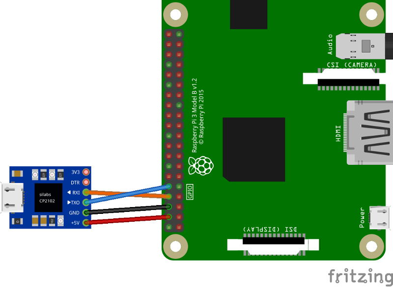

# Operating System development tutorials in Rust on the Raspberry Pi 3

## Notice

**This is a work-in-progress rewrite, started on September 2019. I will first add
code and minimal READMEs, and later write accompanying full-fledged tutorial
text.**

- Check out the `make doc` command to browse the code with HTML goodness.
- Note that the branch is subject to frequent force pushing. If updates happened
  since you last visited, make sure to clone a clean copy to be safe.
- For editing, I recommend [Visual Studio Code] with the [Rust Language Server] extension.
- For practical purposes, the kernel will be a classic [monolith].

_Cheers,
[Andre](https://github.com/andre-richter)_

 [monolith]: https://en.wikipedia.org/wiki/Monolithic_kernel
 [Visual Studio Code]: https://code.visualstudio.com
 [Rust Language Server]: https://github.com/rust-lang/rls

## Prerequisites

Before you can start, you'll need a suitable Rust toolchain.

```bash
curl https://sh.rustup.rs -sSf  \
    |                           \
    sh -s --                    \
    --default-toolchain nightly \
    --component rust-src llvm-tools-preview clippy rustfmt rls rust-analysis

cargo install cargo-xbuild cargo-binutils
```

## USB Serial

I'd also recommend to get an [USB serial debug
cable](https://www.adafruit.com/product/954). You connect it to the GPIO pins
14/15.

[Tutorial 6](06_drivers_gpio_uart) is the first where you can use it. Earlier tutorials will work solely with `QEMU`.



## License

Licensed under the MIT license ([LICENSE-MIT](LICENSE) or http://opensource.org/licenses/MIT).
